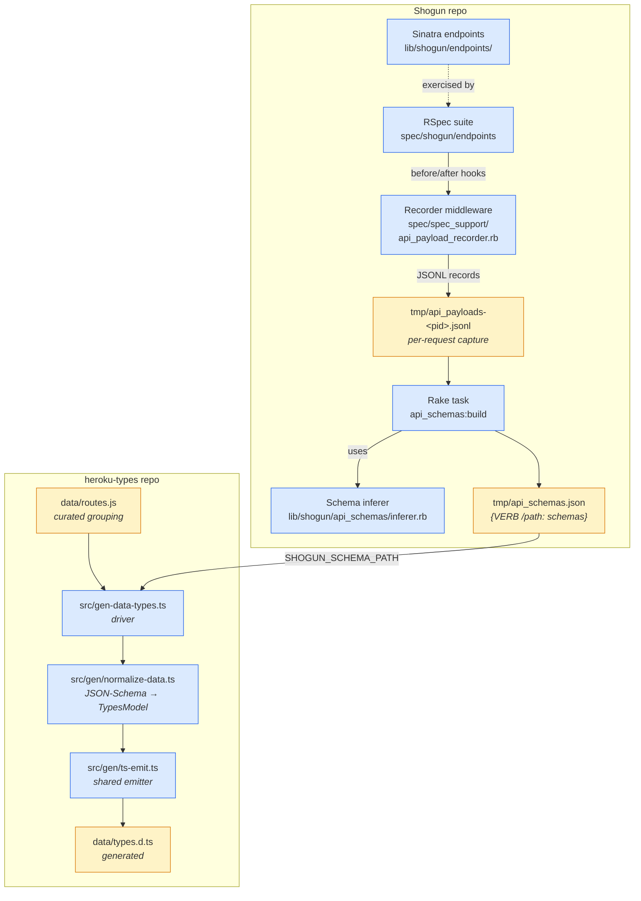

# `data` variant pipeline — architecture & design

This document describes how TypeScript types for the `data` variant are
generated. It complements the user-facing instructions in
[`README.md`](../README.md), and is intended for engineers maintaining or
extending the pipeline.

## Background and motivation

The `3.sdk` variant is generated from the Heroku Platform API's published
JSON hyperschema. Shogun — Heroku's data-services control plane — does not
publish a hyperschema, but it is the backing service for the `data` variant
that this package needs to expose. The pipeline described here closes that
gap by deriving JSON Schemas from Shogun's spec suite and rendering them as
TypeScript using a hand-curated resource grouping.

The grouping is hand-curated rather than auto-derived because Shogun's
Sinatra namespaces and class hierarchies were optimized for the team that
maintains them, not for SDK consumers. The same logical resource (e.g.
`transfer`) is split across multiple Sinatra classes and path prefixes; no
mechanical rule reproduces the consumer-friendly grouping in
[`data/routes.js`](../data/routes.js). See the trade-off discussion in the
section [Resource grouping is not auto-derivable](#resource-grouping-is-not-auto-derivable)
below.

## Pipeline overview

## Components

### 1. Recorder (Shogun)

`spec/spec_support/api_payload_recorder.rb` installs `before` and `after`
filters on `Shogun::Endpoints::Base`. The filters auto-load via the existing
`require_glob` in `spec_helper.rb`, so simply running the spec suite is
sufficient to populate the capture file. No changes to individual specs are
needed.

The `before` filter snapshots the raw request body before the handler
consumes it, then rewinds the IO so the handler still sees a fresh body.
The `after` filter pairs that snapshot with the matched route from
`request.env["sinatra.route"]`, the response status, and the response body.
One JSONL record is written per dispatched request.

Two design choices worth highlighting:

- **Read raw bytes, not `body_params`.** `body_params` is post-parse and
  lossy (already coerced); the wire bytes are ground truth and tell us
  exactly what schema a real client sent.
- **Hook on the base class, not each endpoint.** Sinatra filter inheritance
  covers every endpoint subclass through one registration, keeping the
  recorder isolated from the endpoint files themselves.

### 2. Inferer (Shogun)

`lib/shogun/api_schemas/inferer.rb` is a pure-Ruby JSON Schema (draft-07
style) merger. It implements the genson-style algorithm:

- **Objects:** union of property names; `required` is the *intersection*
  of keys observed across all examples; per-property recursive merge.
- **Arrays:** one items-schema, formed by merging every observed element.
- **Primitives:** union into `"type": [a, b]`; `integer + number` collapses
  to `number`; `null + T` collapses to `"type": [T, "null"]`.
- **Mixed:** falls back to `anyOf` rather than picking a winner.

The inferer captures *shape* faithfully and *types* as well as the example
set allows. `format`, `pattern`, and `enum` are intentionally out of scope
— inferring them reliably needs more signal than spec traffic provides.

The intersection-based `required` rule is deliberate: marking a
spec-omitted-but-actually-required field as optional is the safer
direction. The inverse (marking optional fields required) breaks
legitimate clients.

### 3. Aggregator (Shogun)

`lib/tasks/api_schemas.rake` provides two tasks:

- `api_schemas:build` reads every `tmp/api_payloads-*.jsonl`, groups
  records by `"VERB /path"`, runs the inferer over the request examples
  and the response examples (per status code), and writes
  `tmp/api_schemas.json`.
- `api_schemas:show ROUTE='VERB /path'` pretty-prints the schemas for one
  route — useful for spot-checking.

The output schema is a flat map keyed by `"VERB /path"`. Each value
contains a `request` schema (or `null` for GET/DELETE), a `responses` map
keyed by status code, and counts of how many examples contributed.

### 4. Curated grouping (heroku-types)

[`data/routes.js`](../data/routes.js) is a hand-edited file that maps
SDK-shaped resource names (e.g. `transfer`, `postgresPool`) to one or more
calls of the form `{ method, path, hasRequestBody? }`. This file is the
**source of truth** for resource grouping. The generator never invents new
resources or moves methods between resources — it only fills in
`Opts`/`Result` types from the schema artifact.

To add or rename a resource, edit `data/routes.js` (and optionally
`data/routes.d.ts`) and re-run the generator.

### 5. Type generator (heroku-types)

[`src/gen-data-types.ts`](../src/gen-data-types.ts) is a thin driver
whose `main()` is invoked via `npm run generate:data`. A
`process.argv[1] === fileURLToPath(...)` guard ensures importing the
module does **not** trigger filesystem reads or writes. It:

1. Imports `data/routes.js` as an ES module (no parsing — the curated
   resources are read directly as JavaScript values).
2. Reads `tmp/api_schemas.json` from the Shogun checkout (path supplied
   via `SHOGUN_SCHEMA_PATH`).
3. Calls `generateDataTypes(routes, schemas)` which delegates to
   [`src/gen/normalize-data.ts`](../src/gen/normalize-data.ts) +
   [`src/gen/ts-emit.ts`](../src/gen/ts-emit.ts):
   - Normalizes route param syntax — Shogun emits both `{name}` and
     `:name` forms; both sides are collapsed to `:name` before lookup.
   - Picks the principal response shape: `200`, then `201`/`202`, else
     the first non-empty response.
   - Produces `*Opts` (request body) and `*Result` (principal response)
     types using the same naming convention as `3.sdk/types.d.ts`
     (`<ResourcePascal><MethodPascal>Opts` / `Result`). Schemas without
     properties become `export type X = Record<string, unknown>`
     aliases rather than empty interfaces.
   - Emits the `HerokuClient` interface, with path params hoisted to
     positional `string` arguments and the request body (if any) as
     the trailing `requestBody: ...Opts` parameter.
4. Methods with no schema coverage are typed as `Promise<unknown>` so
   they're easy to find with grep.
5. Writes `data/types.d.ts`.

## Trust boundaries and failure modes

- **Schema fidelity is bounded by spec coverage.** Roughly 94% of the
  curated 72 methods get at least a response schema today; the remaining
  4 surface as TODO comments in the generated file. As Shogun's spec
  suite grows, coverage rises automatically — no generator change
  required.
- **Sparse examples produce thin schemas.** A field whose every example
  is an empty array becomes `Array<unknown>`. The generator surfaces
  the unknown rather than fabricating an item shape.
- **The recorder must never break a spec.** `safe_parse_json` returns
  `nil` rather than raising on malformed JSON; reading the response body
  is best-effort. If the recorder file is removed entirely, specs still
  pass.
- **Idempotency.** Re-running both halves of the pipeline on unchanged
  inputs produces a byte-identical `data/types.d.ts`. Schema drift
  between Shogun and the SDK becomes a reviewable PR diff rather than
  something a human has to discover.

## Resource grouping is not auto-derivable

The hand-built `data/types.d.ts` groups by **consumer-facing resource
noun**, and that grouping crosses both Sinatra class boundaries and
path-prefix boundaries:

- `transfer` spans `/client/v11/apps/{name}/transfers/*` and
  `/client/v11/databases/{name}/transfers/*` — two different path
  prefixes and (almost certainly) two different Sinatra classes.
- `database` includes `/client/v11/databases/{name}` and
  `/client/v11/databases/{name}/upgrade/*`, which live in distinct
  endpoint classes in Shogun.
- `postgres` and `postgresDatabase` both touch postgres but live under
  entirely different prefixes (`/data/postgres/v1/*` vs.
  `/postgres/v0/databases/*`) — they're served by genuinely different
  APIs and the SDK preserves that distinction.

Two mechanical strategies were considered and rejected for the role
that `data/routes.js` plays today:

- **Class-based grouping.** Faithful to Shogun's architecture, but
  produces a long tail of tiny "resources" and a junk-drawer
  `admin-api` mega-resource. Doesn't match how SDK consumers think
  about the API.
- **Path-segment grouping.** Closer to consumer mental model, but
  requires picking the "right" segment per path with no consistent
  rule across `/heroku/...`, `/data/postgres/v1/...`, `/admin-api/...`,
  `/v2/catalog`, and so on. Loses the broker-vs-client distinction.

Neither strategy reproduces the curated layout mechanically. The current
design treats grouping as a curation decision and generation as a
mechanical fill-in. This is intentional: it lets the SDK shape track API
design choices, while the type bodies track the wire reality of Shogun.

## Future work

- **Sidecar overrides.** A YAML file (e.g. `data/overrides.yml`) keyed
  by `(resource.method)` with property-level corrections — useful for
  tightening `Array<unknown>` and other inference gaps without
  regenerating from richer spec data.
- **Spec-coverage targets.** The 4 TODO methods are the smallest
  closeable gap. Each represents a real Shogun endpoint with no spec
  exercising it; opening tickets to add coverage closes the loop.
- **Per-route schema files.** Splitting `tmp/api_schemas.json` into
  per-route files (e.g. `docs/api_schemas/post_heroku_resources.json`)
  would make schema changes review as smaller, scoped diffs in PRs.
- **Hyperschema emission.** With grouping curated and types inferred,
  a Hyperschema doc could be emitted for parity with `3.sdk`'s
  pipeline. The shared emission core (`src/gen/model.ts` +
  `src/gen/ts-emit.ts`) is now in place, so a Shogun-derived
  hyperschema could simply be fed through `normalize-hyperschema.ts`
  and the bespoke `normalize-data.ts` deleted entirely. Not necessary
  for the current goal, but a natural extension.

## Shared emission core

Both the `data` and `3.sdk` pipelines feed the same emitter. Each
pipeline normalizes its input into an intermediate `TypesModel`
(`src/gen/model.ts`); `emitTypes(model)` in `src/gen/ts-emit.ts`
turns that model into the `.d.ts` text. Output style choices —
quoting, indentation, JSDoc form, identifier escaping, union
ordering, `HerokuClient` assembly — live in one place.

For the `data` variant specifically:

- `src/gen/normalize-data.ts` is the JSON-Schema → `TypesModel`
  step. Schemas with no properties become `Record<string, unknown>`
  type aliases rather than empty interfaces, which matches how
  nested empty objects are rendered.
- `src/gen-data-types.ts` is a thin driver: load fixtures, call
  `generateDataTypes()`, write `data/types.d.ts`.
- The emitter is invoked with `emitResourceShapes: false` because
  the `data` pipeline has no top-level resource interface (curated
  routes don't carry a resource-level shape — only per-route
  Opts/Result types).
